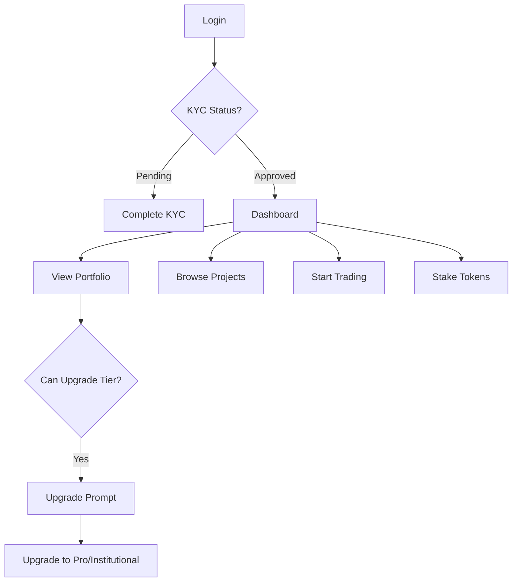
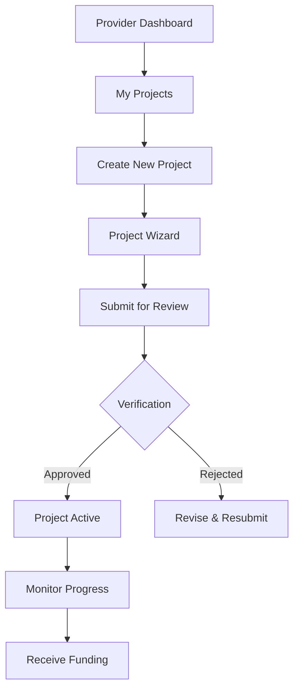
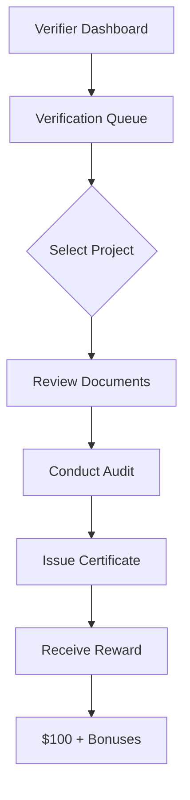

# 🎨 Frontend Architecture Documentation

## Overview

This document outlines the enhanced frontend architecture for the DECARBONIZE platform, organized according to modern best practices and the reference structure provided in `UsersStructure.md`.

---

## 📁 Directory Structure

```
src/
├── pages/
│   ├── public/                     # Public pages (no auth required)
│   ├── auth/                       # Authentication pages
│   ├── dashboard/                  # Dashboard pages by role
│   │   ├── investor/              # Investor-specific dashboards
│   │   ├── provider/              # Carbon provider interfaces
│   │   ├── verifier/              # Verification authority pages
│   │   └── advisor/               # Advisor client management
│   ├── admin/                     # Admin panel pages
│   ├── user/                      # Legacy user pages
│   ├── advisor/                   # Advisor pages
│   ├── ngo/                       # NGO pages
│   ├── provider/                  # Provider pages
│   └── verification/              # Verification pages
│
├── components/
│   ├── layout/                    # Layout components
│   │   ├── Header.tsx            # Top navigation
│   │   ├── Footer.tsx            # Footer
│   │   ├── Sidebar.tsx           # Sidebar navigation
│   │   └── DashboardLayout.tsx   # NEW: Enhanced dashboard layout
│   │
│   ├── projects/                  # Project-related components
│   │   ├── ProjectCard.tsx
│   │   ├── ProjectGrid.tsx
│   │   ├── ProjectFilters.tsx
│   │   ├── detail/               # Project detail components
│   │   │   ├── ProjectHero.tsx
│   │   │   ├── OverviewTab.tsx
│   │   │   ├── ImpactTab.tsx
│   │   │   └── FinancialsTab.tsx
│   │   └── create/               # Project creation wizard
│   │       ├── ProjectWizard.tsx
│   │       ├── BasicInfoStep.tsx
│   │       └── ReviewStep.tsx
│   │
│   ├── trading/                   # Trading interface components
│   │   ├── TradingChart.tsx
│   │   ├── OrderBook.tsx
│   │   ├── TradeForm.tsx
│   │   └── OrderHistory.tsx
│   │
│   ├── wallet/                    # Wallet components
│   │   ├── WalletConnect.tsx
│   │   ├── BalanceDisplay.tsx
│   │   ├── SendReceive.tsx
│   │   └── TransactionHistory.tsx
│   │
│   ├── staking/                   # Staking components
│   │   ├── StakingPools.tsx
│   │   ├── StakeForm.tsx
│   │   └── RewardsTracker.tsx
│   │
│   ├── kyc/                       # KYC components
│   │   ├── KYCWizard.tsx
│   │   ├── DocumentUpload.tsx
│   │   └── StatusTracker.tsx
│   │
│   ├── admin/                     # Admin components
│   │   ├── users/
│   │   ├── projects/
│   │   └── content/
│   │
│   ├── charts/                    # Chart components
│   │   ├── LineChart.tsx
│   │   ├── BarChart.tsx
│   │   └── PieChart.tsx
│   │
│   └── ui/                        # Reusable UI components
│       ├── Button.tsx
│       ├── Card.tsx
│       ├── Modal.tsx
│       └── Badge.tsx
│
├── hooks/                         # Custom React hooks
│   ├── useLocalStorage.ts
│   ├── useRealtimeSubscription.ts
│   └── useSupabase.ts
│
├── store/                         # State management (Zustand)
│   ├── authStore.ts
│   ├── dataStore.ts
│   ├── walletStore.ts
│   └── ...
│
├── services/                      # API services
│   ├── supabaseService.ts
│   └── blockchainService.ts
│
├── utils/                         # Utility functions
│   ├── permissions.ts
│   ├── permissionHelpers.ts
│   └── supabaseHelpers.ts
│
└── types/                         # TypeScript types
    └── index.ts
```

---

## 🎯 Key Components

### 1. DashboardLayout Component

**Location**: `src/components/layout/DashboardLayout.tsx`

**Purpose**: Unified dashboard layout with role-based navigation and tier information.

**Features**:
- ✅ Role-based sidebar navigation
- ✅ Investor tier badge display
- ✅ Real-time notifications
- ✅ User profile dropdown
- ✅ Responsive mobile menu
- ✅ KYC status alerts
- ✅ Tier upgrade prompts
- ✅ Search functionality

**Navigation Structure**:
```typescript
// Example for Institutional Investor
navItems = [
  { label: 'Dashboard', path: '/dashboard' },
  { label: 'Portfolio', path: '/portfolio' },
  { label: 'Trading', path: '/trading', badge: 'PRO' },
  { label: 'Wallet', path: '/wallet' },
  { label: 'Staking', path: '/staking' },
  { label: 'Projects', path: '/projects' },
]
```

### 2. InvestorDashboard Component

**Location**: `src/pages/dashboard/investor/InvestorDashboard.tsx`

**Purpose**: Comprehensive dashboard for all investor tiers (Free, Pro, Institutional).

**Key Sections**:

#### A. Portfolio Stats (4-card grid)
```typescript
- Total Portfolio Value (with 24h change)
- Carbon Credits (tons CO₂ offset)
- Staking Rewards (with tier multiplier)
- Total ROI percentage
```

#### B. Portfolio Allocation (2/3 width)
- Visual breakdown by project category
- Funding progress bars
- Trading fee display
- Monthly limit tracking (if applicable)

#### C. Quick Actions (1/3 width)
- Quick Trade card
- Browse Projects card
- Start Staking card

#### D. Recent Activity Feed
- Investment transactions
- Staking rewards
- Trading activity
- With visual indicators

**Tier-Specific Features**:
- **Free**: Basic stats + upgrade prompt
- **Pro**: Advanced analytics + 1.25x staking badge
- **Institutional**: Full analytics + API access info

### 3. ProviderProjectsPage Component

**Location**: `src/pages/dashboard/provider/ProviderProjectsPage.tsx`

**Purpose**: Project management interface for carbon providers.

**Features**:
- ✅ Project stats overview (4-card grid)
- ✅ Search and filter functionality
- ✅ Status-based filtering (draft, submitted, active, etc.)
- ✅ Visual project cards with:
  - Status badges
  - Funding progress
  - Carbon credits
  - Investor count
  - Quick actions (View, Edit)
- ✅ Create new project button
- ✅ Empty state with CTA

**Project Status Flow**:
```
Draft → Submitted → Under Review → Approved → Active
                                 ↓
                              Rejected
```

### 4. VerificationQueuePage Component

**Location**: `src/pages/dashboard/verifier/VerificationQueuePage.tsx`

**Purpose**: Verification queue and reward system for verifiers.

**Key Features**:

#### A. Stats Dashboard
- Pending verifications count
- High priority alerts
- Estimated total rewards
- Total carbon credits to verify

#### B. Reward System Banner
```
Base Reward: $100
Accuracy Bonus: +$50 (95%+ accuracy)
Speed Bonus: +$25 (fast-track)
Total Possible: $175 per verification
```

#### C. Queue Management
- Priority-based filtering (High, Medium, Low)
- Search by project/provider
- Project cards showing:
  - Carbon credits
  - Location
  - Document count
  - Estimated reward
  - Time remaining
  - Priority badge

#### D. Quick Actions
- "Start Verification" button per project
- Direct link to verification interface

---

## 🎨 Design System

### Color Palette

```css
/* Primary Colors */
--emerald-50: #ecfdf5
--emerald-600: #059669
--emerald-700: #047857

/* Tier Colors */
--institutional: Indigo gradient
--pro: Violet
--free: Gray

/* Status Colors */
--success: Green (#10b981)
--warning: Yellow (#f59e0b)
--error: Red (#ef4444)
--info: Blue (#3b82f6)
```

### Typography

```css
/* Headings */
h1: 3xl font-bold (Dashboard titles)
h2: xl font-bold (Section headers)
h3: lg font-bold (Card titles)

/* Body */
text-sm: Secondary text
text-base: Primary content
```

### Components

#### Button Styles
```typescript
Primary: bg-emerald-600 hover:bg-emerald-700
Secondary: border border-gray-300 hover:bg-gray-50
Danger: bg-red-600 hover:bg-red-700
```

#### Card Style
```typescript
className="bg-white rounded-xl shadow-sm p-6 border border-gray-100"
```

#### Badge Style
```typescript
Status: px-3 py-1 rounded-full text-xs font-medium
Tier: px-3 py-1 rounded-full bg-gradient-to-r
```

---

## 🚀 User Flows

### 1. Investor Journey



### 2. Carbon Provider Journey



### 3. Verifier Journey



---

## 📱 Responsive Design

### Breakpoints

```typescript
sm: '640px'   // Mobile landscape
md: '768px'   // Tablet
lg: '1024px'  // Desktop
xl: '1280px'  // Large desktop
```

### Mobile Considerations

#### Dashboard Layout
- Hamburger menu on mobile
- Collapsible sidebar
- Full-width cards
- Touch-friendly buttons (min 44px)

#### Stats Grid
- 1 column on mobile
- 2 columns on tablet
- 4 columns on desktop

#### Navigation
- Bottom tab bar (optional)
- Swipe gestures for sidebar
- Pull-to-refresh

---

## 🔐 Permission-Based UI

### Component-Level Permissions

```typescript
// Example: Show create project button only for providers
{hasPermission(user, 'projects.create') && (
  <Link to="/dashboard/provider/projects/new">
    Create Project
  </Link>
)}
```

### Route-Level Protection

```typescript
<ProtectedRoute allowedRoles={['carbon_provider']}>
  <ProviderProjectsPage />
</ProtectedRoute>
```

### Feature Flags by Tier

```typescript
// Show advanced trading only for Pro/Institutional
{user?.investorTier !== 'free' && (
  <AdvancedTradingFeatures />
)}
```

---

## 🎯 Best Practices

### 1. Component Organization

✅ **DO**:
- One component per file
- Co-locate related components
- Use descriptive names
- Keep components under 300 lines

❌ **DON'T**:
- Mix business logic with UI
- Create deeply nested structures
- Use generic names like "Component1"

### 2. State Management

✅ **DO**:
- Use Zustand for global state
- Local state for UI-only concerns
- Memoize expensive calculations
- Clean up subscriptions

❌ **DON'T**:
- Prop drill more than 2 levels
- Store derived data in state
- Create unnecessary stores

### 3. Performance

✅ **DO**:
- Lazy load pages
- Use React.memo for expensive components
- Optimize images
- Debounce search inputs

❌ **DON'T**:
- Load all data at once
- Re-render entire lists
- Use inline functions in renders

### 4. Accessibility

✅ **DO**:
- Use semantic HTML
- Add ARIA labels
- Ensure keyboard navigation
- Test with screen readers

❌ **DON'T**:
- Use divs for buttons
- Forget focus styles
- Ignore color contrast

---

## 🧪 Testing Strategy

### Unit Tests
```typescript
// Component rendering
test('renders investor dashboard', () => {
  render(<InvestorDashboard />);
  expect(screen.getByText('Dashboard')).toBeInTheDocument();
});
```

### Integration Tests
```typescript
// User flows
test('investor can upgrade tier', async () => {
  // Setup
  // Navigate to upgrade
  // Complete upgrade
  // Verify new tier
});
```

### E2E Tests
```typescript
// Critical paths
- Login → Dashboard → Invest
- Provider → Create Project → Submit
- Verifier → Queue → Verify
```

---

## 🚀 Performance Metrics

### Target Metrics

```
First Contentful Paint: < 1.5s
Largest Contentful Paint: < 2.5s
Time to Interactive: < 3.5s
Cumulative Layout Shift: < 0.1
```

### Optimization Techniques

1. **Code Splitting**
   - Lazy load pages
   - Dynamic imports for heavy components

2. **Asset Optimization**
   - Compress images (WebP)
   - Minify CSS/JS
   - Use CDN for static assets

3. **Caching**
   - Service worker for offline
   - Local storage for user preferences
   - React Query for API caching

---

## 🔄 Migration Guide

### From Old Structure

1. **Update Imports**
```typescript
// Old
import { UserDashboard } from './pages/user/UserDashboard';

// New
import { InvestorDashboard } from './pages/dashboard/investor/InvestorDashboard';
```

2. **Wrap in DashboardLayout**
```typescript
// Old
export const MyPage = () => <div>Content</div>;

// New
export const MyPage = () => (
  <DashboardLayout>
    <div>Content</div>
  </DashboardLayout>
);
```

3. **Update Role Checks**
```typescript
// Old
if (user.role === 'user')

// New
if (['free_investor', 'pro_investor', 'institutional_investor'].includes(user.role))
```

---

## 📚 Component Library

### Created Components

1. ✅ `DashboardLayout` - Universal dashboard wrapper
2. ✅ `InvestorDashboard` - Tier-aware investor dashboard
3. ✅ `ProviderProjectsPage` - Project management for providers
4. ✅ `VerificationQueuePage` - Verifier workflow interface

### Planned Components

1. ⏳ `AdvisorClientsPage` - Client management for advisors
2. ⏳ `KYCLevelWizard` - Multi-level KYC form
3. ⏳ `TradingInterface` - Advanced trading UI
4. ⏳ `ProjectDetailTabs` - Enhanced project details
5. ⏳ `ImpactDashboard` - Carbon impact visualization

---

## 🎓 Learning Resources

### Internal Documentation
- `SUSTAINABILITY_RECOMMENDATIONS.md` - Business logic and expert recommendations
- `UsersStructure.md` - Reference architecture
- `README.md` - Project overview

### External Resources
- React Router v6 Docs
- Tailwind CSS Documentation
- Zustand State Management
- Lucide React Icons

---

**Last Updated**: 2025-10-05
**Version**: 2.0
**Status**: Implementation In Progress ✅

